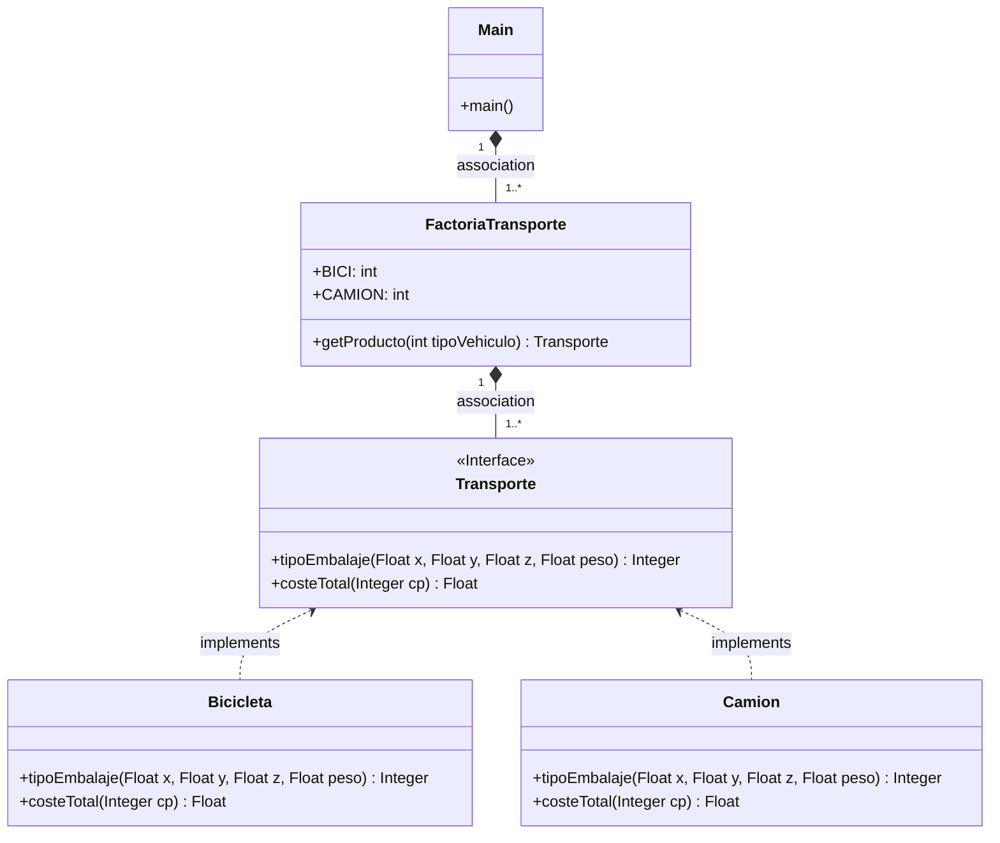

# Práctica COD: Factory method Transporte
Realiza una aplicación en java que distinga diferentes tipo de transporte para enviar un paquete.

* Instanciar diferentes tipos de transportes, en principio solo camión y bicicleta

    Métodos comunes:
  * costeTotal(Integer cp) : Float
    - Recibe el código postal
    - Devuelve el coste 
  * tipoEmbalaje(Float x, Float y, Float z, Float peso): Integer
    - Recibe dimensiones y peso
    - Devuelve tipo de embalaje (que es un entero)
    
    0 - palet
    
    1 - envoltorio cartón
  
    2 - caja de madera

