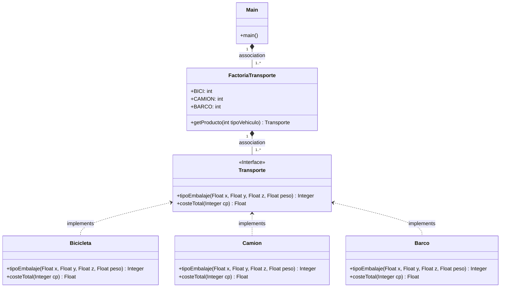

# Examen COD: Factory method Transporte
### ¿Qué es el patrón de diseño Factory?
El patrón de diseño Factory (también conocido como Factory Method) es un patrón creacional que proporciona una interfaz para crear objetos en una superclase. Su objetivo es encapsular
la creación de objetos, de modo que el código cliente no tiene que conocer la lógica de creación de los mismos. 
En lugar de crearlos directamente, el código cliente llama a un método en una fábrica (Factory) que se encarga de crear y devolver el objeto adecuado.

Realiza una aplicación en Java que distinga diferentes tipos de transporte para enviar un paquete por medio del patrón de diseño Factory.

* Instanciar diferentes tipos de transportes: camión, bicicleta y barco.

Métodos comunes marcados por la interfaz Transporte, que implementarán los tres medios ya mencionados:
  * costeTotal(Integer cp) : Float
    - Recibe el código postal
    - Devuelve el coste 
  * tipoEmbalaje(Float x, Float y, Float z, Float peso): Integer
    - Recibe dimensiones y peso
    - Devuelve tipo de embalaje (que es un entero)
    
    0 - palet
    
    1 - envoltorio cartón
  
    2 - caja de madera

